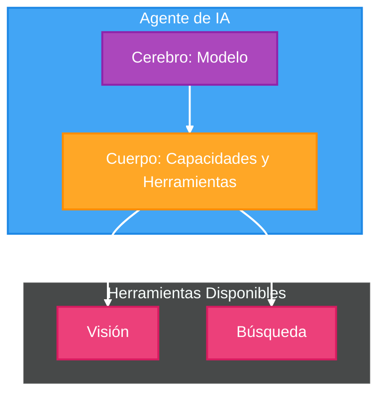
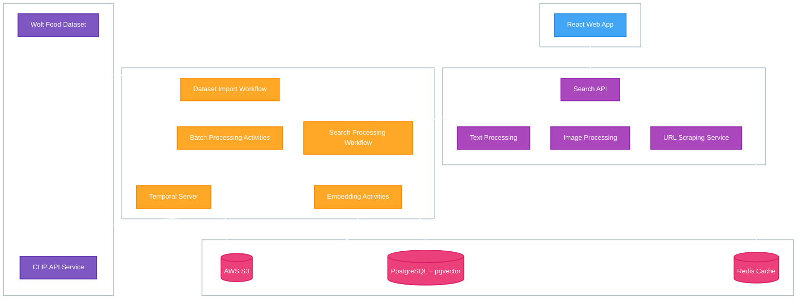
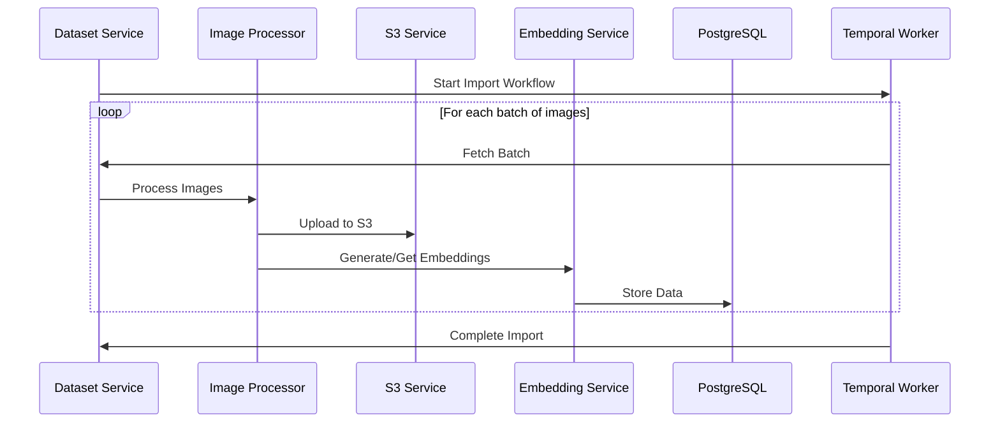
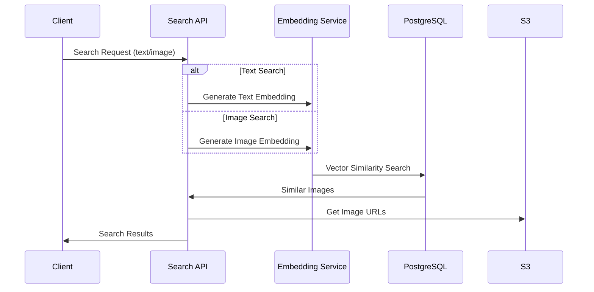

# Image Search Platform Architecture



## Overview

This document outlines the architecture and data flow for the image search platform using the Wolt Food CLIP-ViT-B-32 embeddings dataset. The platform will provide fast and accurate image search capabilities using vector similarity in PostgreSQL.

## High Level Architecture



### Key Workflows

1. **Image Search Workflow**
```ts
interface SearchWorkflowInput {
  type: 'text' | 'image' | 'url';
  query: string;
  limit?: number;
  similarity?: number;
}

async function imageSearchWorkflow(input: SearchWorkflowInput) {
  // 1. Generate embedding based on input type
  let embedding: number[];
  
  switch(input.type) {
    case 'text':
      embedding = await activities.generateTextEmbedding(input.query);
      break;
    case 'image':
      embedding = await activities.generateImageEmbedding(input.query);
      break;
    case 'url':
      // For product pages, first extract main image
      const imageUrl = await activities.scrapeMainImage(input.query);
      embedding = await activities.generateImageEmbedding(imageUrl);
      break;
  }

  // 2. Search similar images in PostgreSQL using pgvector
  const results = await activities.findSimilarImages({
    embedding,
    limit: input.limit || 10,
    minSimilarity: input.similarity || 0.7
  });

  // 3. Generate presigned URLs if images are in S3
  const withPresignedUrls = await activities.generatePresignedUrls(results);

  return withPresignedUrls;
}
```

2. **New Image Upload Workflow**
```ts
interface UploadWorkflowInput {
  type: 'url' | 'file';
  source: string;
  metadata?: Record<string, any>;
}

async function imageUploadWorkflow(input: UploadWorkflowInput) {
  try {
    // 1. Get image buffer (either from URL or file)
    const imageBuffer = input.type === 'url' 
      ? await activities.downloadImage(input.source)
      : await activities.readFileBuffer(input.source);

    // 2. Generate a unique name
    const fileName = await activities.generateUniqueFileName(input.source);

    // 3. Upload to storage and get URL
    const imageUrl = await activities.uploadImage(imageBuffer, fileName);

    // 4. Generate embedding
    const embedding = await activities.generateImageEmbedding(imageBuffer);

    // 5. Store in PostgreSQL
    const image = await activities.storeImage({
      name: fileName,
      imageUrl,
      externalUrl: input.type === 'url' ? input.source : null,
      embedding,
      metadata: input.metadata
    });

    return image;
  } catch (error) {
    // Cleanup any partial uploads
    await activities.cleanupFailedUpload(fileName);
    throw error;
  }
}
```

### SQL Queries for Vector Search

```sql
-- Basic similarity search
SELECT id, name, image_url, 
       1 - (embedding <=> $1) as similarity
FROM image
WHERE 1 - (embedding <=> $1) > $2  -- $2 is minimum similarity threshold
ORDER BY similarity DESC
LIMIT $3;

-- Combined text and vector search
SELECT id, name, image_url,
       1 - (embedding <=> $1) as similarity
FROM image
WHERE name ILIKE $2  -- Text search
  AND 1 - (embedding <=> $1) > $3  -- Vector similarity
ORDER BY similarity DESC
LIMIT $4;
```

### Key Benefits of This Architecture

1. **Reliability**:
   - Temporal handles retries and failure recovery
   - `externalId` prevents duplicate processing
   - Batch processing with individual error handling

2. **Scalability**:
   - Parallel processing within safe batch sizes
   - pgvector's IVFFLAT index for fast similarity search
   - S3 for reliable image storage

3. **Maintainability**:
   - Clear separation of concerns in workflows
   - Activity-based architecture for easy testing
   - Structured error handling and logging

4. **Performance**:
   - Batch processing for efficient imports
   - Indexed vector searches
   - Caching opportunities with Redis (optional)

## Database Schema

```sql
-- Enable the vector extension
CREATE EXTENSION IF NOT EXISTS vector;

-- Create the images table
CREATE TABLE image (
    id SERIAL PRIMARY KEY,
    external_id TEXT,                    -- External ID from dataset
    name TEXT,                           -- Image name/title
    description TEXT,                    -- Image description
    image_url TEXT NOT NULL,             -- URL to image
    external_url TEXT,                   -- Original external URL
    embedding vector(512),               -- CLIP-ViT-B-32 embedding (512 dimensions)
    metadata JSONB,                      -- Additional metadata
    tags TEXT[],                         -- Array of tags
    created_at TIMESTAMP WITH TIME ZONE DEFAULT CURRENT_TIMESTAMP,
    updated_at TIMESTAMP WITH TIME ZONE DEFAULT CURRENT_TIMESTAMP
);

-- Create indexes for efficient querying
CREATE INDEX ix_image_name ON image(name);
CREATE INDEX ix_image_tags ON image USING GIN(tags);
-- ivfflat: vectors are divided in clusters
-- vector_cosine_ops: cosine similarity (used for vector search)
-- lists: number of clusters to balance between speed and accuracy
CREATE INDEX ix_image_embedding ON image USING ivfflat (embedding vector_cosine_ops) WITH (lists = 100);
```

## Data Flow

### 1. Dataset Import Process



### 2. Search Flow



## Implementation Strategy

### 1. Dataset Import Process

1. **Initial Setup**
   - Create S3 bucket for image storage
   - Set up PostgreSQL with pgvector extension
   - Create database schema and indices

2. **Batch Processing**
   - Use Temporal workflows for reliable batch processing
   - Process images in batches of 1000
   - Implement retry mechanisms and error handling
   - Track progress and enable resume capability

3. **Data Transformation**
   - Download images from original URLs
   - Upload to S3 with optimized format/size
   - Store embeddings and metadata in PostgreSQL

### 2. Search Implementation

1. **API Endpoints**
   ```typescript
   @Post('search/text')
   async searchByText(@Body() dto: TextSearchDto) {
     // Generate text embedding
     // Perform vector similarity search
     // Return results with presigned S3 URLs
   }

   @Post('search/image')
   async searchByImage(@Body() dto: ImageSearchDto) {
     // Generate image embedding
     // Perform vector similarity search
     // Return results with presigned S3 URLs
   }

   @Post('search/url')
   async searchByUrl(@Body() dto: UrlSearchDto) {
     // Scrape image from URL
     // Generate image embedding
     // Perform vector similarity search
     // Return results with presigned S3 URLs
   }
   ```

2. **Vector Search Query**
   ```sql
   SELECT id, name, description, s3_path, 
          1 - (embedding <=> $1) as similarity
   FROM images
   WHERE 1 - (embedding <=> $1) > 0.7
   ORDER BY similarity DESC
   LIMIT 10;
   ```

## Performance Considerations

1. **Database Optimization**
   - Use appropriate index strategy (IVFFlat for large datasets)
   - Partition data if needed
   - Monitor and optimize query performance

2. **Caching Strategy**
   - Cache common search results
   - Cache S3 presigned URLs
   - Cache embeddings for frequently accessed items

3. **Batch Processing**
   - Process dataset imports in parallel
   - Use connection pooling
   - Implement backpressure mechanisms

## Monitoring and Metrics

1. **Key Metrics**
   - Search latency
   - Import process progress
   - Vector search accuracy
   - S3 storage usage
   - Database performance

2. **Logging**
   - Search queries and results
   - Import process status
   - Error rates and types
   - Performance bottlenecks

## Next Steps

1. Set up the initial infrastructure:
   - Create S3 bucket
   - Configure PostgreSQL with pgvector
   - Set up Temporal workflows

2. Implement core services:
   - Dataset import service
   - Image processing service
   - Search API endpoints

3. Create monitoring and logging:
   - Set up metrics collection
   - Configure alerting
   - Implement logging strategy

4. Test and optimize:
   - Load testing
   - Performance tuning
   - Query optimization 