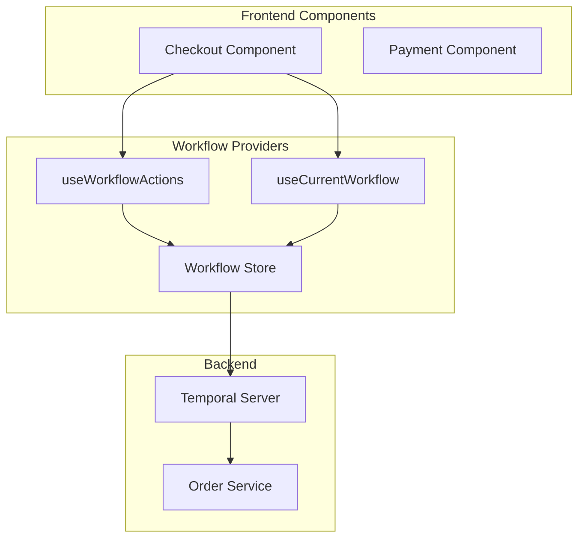

# ProjectX

Tame full-stack chaos with Temporal workflows and React wizardry, the ultimate event-driven architecture for your apps 🧙✨

## Section 1: Introduction to Event-Driven Architecture and ProjectX (Slides 1-10)

### Slide 1: Title Slide
- ProjectX: Full-stack Event-Driven Architecture with Temporal and React
- Subtitle: Building Resilient and Scalable Applications

### Slide 2-3: What is ProjectX?
- Comprehensive full-stack template
- Built with React and Temporal
- Focus on resilience and scalability
- Event-driven architecture principles

### Slide 4-6: Event-Driven Architecture (EDA)
- Core principles of EDA
- Benefits and challenges
- Event producers and consumers
- Event-driven vs traditional architectures

### Slide 7-8: Why Temporal?
- Durable execution guarantees
- Built-in reliability features
- Workflow versioning
- Developer experience

### Slide 9-10: Technology Stack
- Frontend: React, React Query
- Backend: NestJS, TypeScript
- Database: PostgreSQL
- Workflow: Temporal
- APIs: Stripe, SendGrid

## Section 2: Temporal Workflow Orchestration (Slides 11-20)

### Slide 11-13: Understanding Temporal Workflows
- Durable Execution
- State Management
- Error Handling and Retries
- Event Processing (Signals & Updates)

### Slide 14-16: Core Workflow Components
```typescript
interface Workflow<T> {
  referenceId: string;
  step: WorkflowStep;
  maxRetries: number;
  expirationTimeInMilliseconds: number;
  data: T;
  error?: Error;
}

enum WorkflowStep {
  START = 'start',
  PROCESSING = 'processing',
  PAYMENT_PENDING = 'payment_pending',
  COMPLETED = 'completed',
  FAILED = 'failed'
}
```

### Slide 17-18: Workflow Patterns
- Saga Pattern
- Request-Response
- Event-Sourcing
- CQRS Implementation

### Slide 19-20: Error Handling Strategies
- Retry Policies
- Compensation Logic
- Timeout Handling
- Dead Letter Queues

## Section 3: Frontend Integration (Slides 21-30)

### Slide 21-23: Architecture Overview


### Slide 24-26: React Integration Hooks
```typescript
// 1. Workflow Actions Hook
const { handleRun, handleError, handleUpdate } = useWorkflowActions<OrderWorkflow>({
  workflowType: WorkflowTypes.ORDER,
});

// 2. Current Workflow Hook
const currentWorkflow = useCurrentWorkflow<OrderWorkflow>(
  WorkflowTypes.ORDER,
  workflow => workflow.referenceId === referenceId
);

// 3. Workflows Collection Hook
const workflows = useWorkflows<OrderWorkflow>(WorkflowTypes.ORDER);
```

### Slide 27-28: State Management
- Workflow Store Design
- Real-time Updates
- Optimistic Updates
- Cache Management

### Slide 29-30: Component Patterns
- Container Components
- Presentational Components
- Custom Hooks
- Error Boundaries

## Section 4: Real-World Implementation (Slides 31-40)

### Slide 31-33: Payment Processing Flow
1. Order Creation
2. Payment Processing
3. State Updates
4. Error Handling
5. Compensation Handling

### Slide 34-35: Authentication Flow
- User Registration
- Login Process
- Token Management
- Session Handling

### Slide 36-37: Best Practices
- Implementing Retry Logic
- Handling Timeouts
- Managing Concurrent Transactions
- Real-time Updates

### Slide 38: Performance Optimization
- Caching Strategies
- Load Balancing
- Database Optimization
- Monitoring and Metrics

### Slide 39: Security Considerations
- API Security
- Data Encryption
- Rate Limiting
- Access Control

### Slide 40: Resources and Next Steps

#### Learning Resources
- [Temporal 101 with TypeScript](https://temporal.talentlms.com/catalog/info/id:135)
- [Exploring Durable Execution](https://temporal.talentlms.com/catalog/info/id:165)
- [Workflow Versioning](https://temporal.talentlms.com/catalog/info/id:171)

#### Getting Started
1. Clone the ProjectX Template
2. Set up Development Environment
3. Run Example Workflows
4. Explore Code Examples

