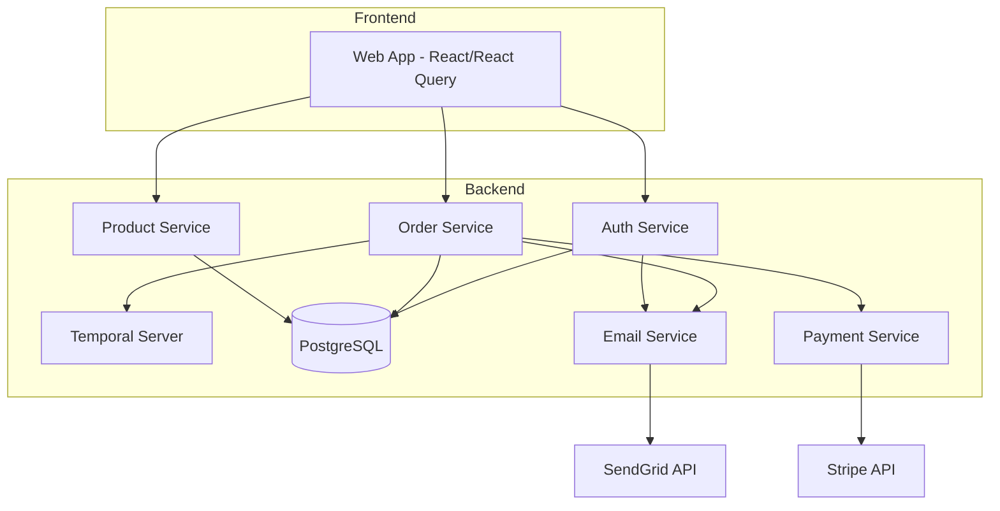
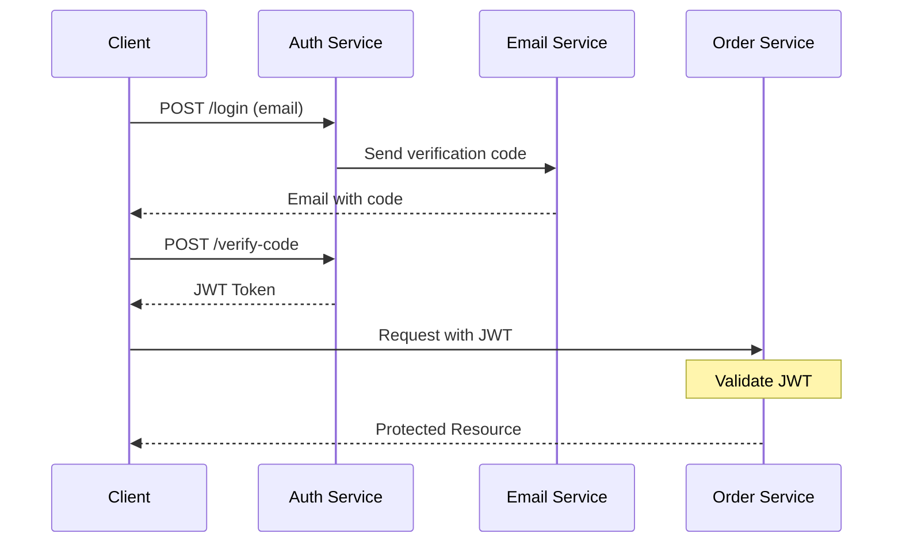
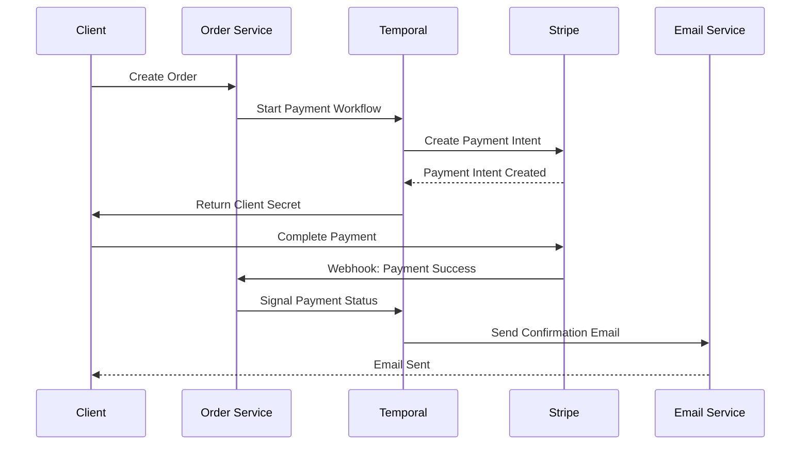
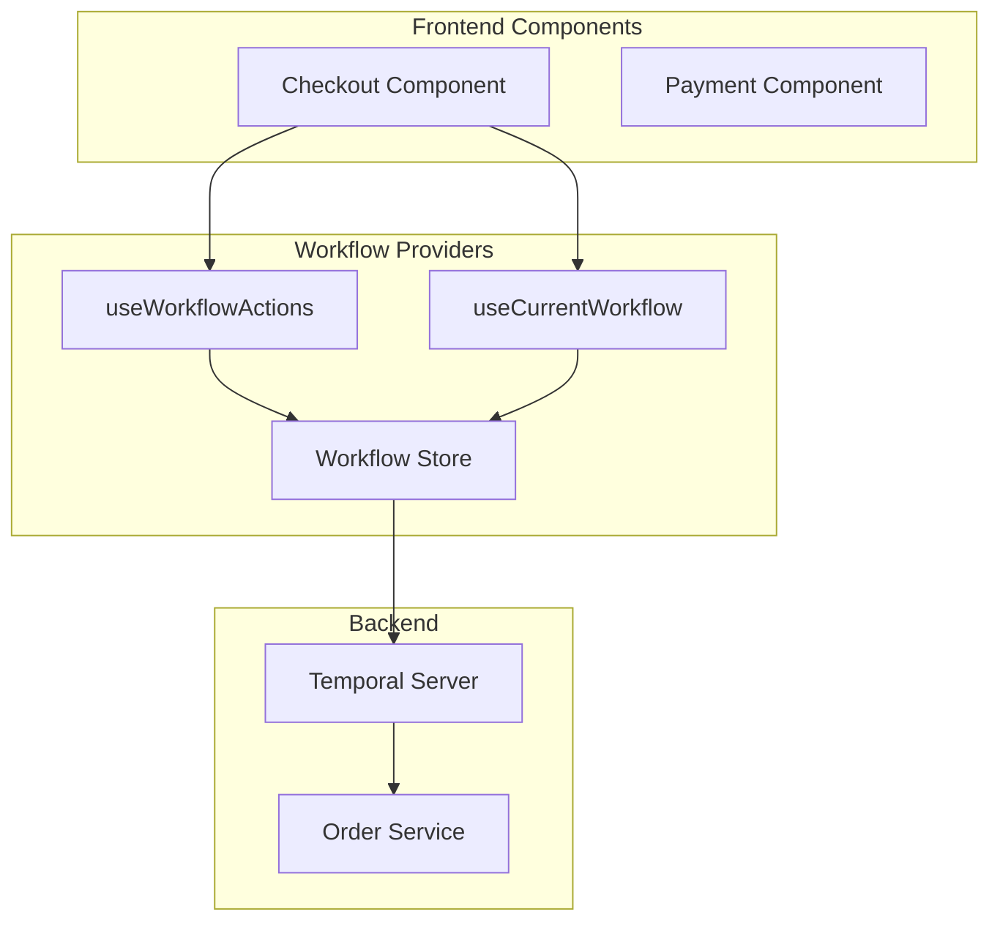

# ProjectX Presentation Slides

## Slide 1: Title
### ProjectX: Full-stack Event-Driven Architecture
Tame full-stack chaos with Temporal workflows and React wizardry, the ultimate event-driven architecture for your apps 🧙✨

## Slide 2: System Architecture Overview
### High-Level System Components


### Key Components
- Frontend: React-based web application
- Backend Services: Auth, Order, Product
- Infrastructure: Temporal, PostgreSQL
- External Services: Stripe, SendGrid

## Slide 3: Service Architecture
### Service Breakdown

#### Auth Service (Port 8081)
- JWT-based authentication
- User management
- Session handling

#### Order Service (Port 8082)
- Order management
- Payment processing
- Temporal workflow orchestration

#### Product Service (Port 8083)
- Product catalog management
- Inventory tracking
- Product search and filtering

## Slide 4: Authentication Flow
### User Authentication Process


### Notes
- Email-based authentication
- JWT token generation
- Protected resource access

## Slide 5: Payment Processing Flow
### Order and Payment Workflow


### Key Points
- Temporal workflow orchestration
- Stripe integration
- Email notifications

## Slide 6: Core Workflow Components
### Workflow Interface
```typescript
interface Workflow<T> {
  referenceId: string;
  step: WorkflowStep;
  maxRetries: number;
  expirationTimeInMilliseconds: number;
  data: T;
  error?: Error;
}

enum WorkflowStep {
  START = 'start',
  PROCESSING = 'processing',
  PAYMENT_PENDING = 'payment_pending',
  COMPLETED = 'completed',
  FAILED = 'failed'
}
```

### Notes
- Generic workflow interface
- Step-based progression
- Error handling support

## Slide 7: Frontend Integration
### Component Architecture


## Slide 8: React Integration Hooks
### Custom Workflow Hooks
```typescript
// 1. Workflow Actions Hook
const { handleRun, handleError, handleUpdate } = useWorkflowActions<OrderWorkflow>({
  workflowType: WorkflowTypes.ORDER,
});

// 2. Current Workflow Hook
const currentWorkflow = useCurrentWorkflow<OrderWorkflow>(
  WorkflowTypes.ORDER,
  workflow => workflow.referenceId === referenceId
);

// 3. Workflows Collection Hook
const workflows = useWorkflows<OrderWorkflow>(WorkflowTypes.ORDER);
```

### Notes
- Type-safe workflow hooks
- Action management
- State synchronization

## Slide 9: Technology Stack
### Full Stack Overview
- **Frontend**
  - React
  - React Query
  - TailwindCSS

- **Backend**
  - NestJS
  - TypeScript
  - PostgreSQL

- **Workflow Engine**
  - Temporal

- **External Services**
  - Stripe (Payments)
  - SendGrid (Email)

## Slide 10: Next Steps
### Getting Started
1. Clone the ProjectX Template
2. Set up Development Environment
3. Run Example Workflows
4. Explore Code Examples

### Learning Resources
- [Temporal 101 with TypeScript](https://temporal.talentlms.com/catalog/info/id:135)
- [Exploring Durable Execution](https://temporal.talentlms.com/catalog/info/id:165)
- [Workflow Versioning](https://temporal.talentlms.com/catalog/info/id:171)