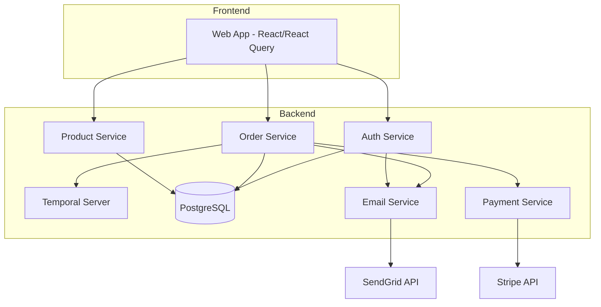
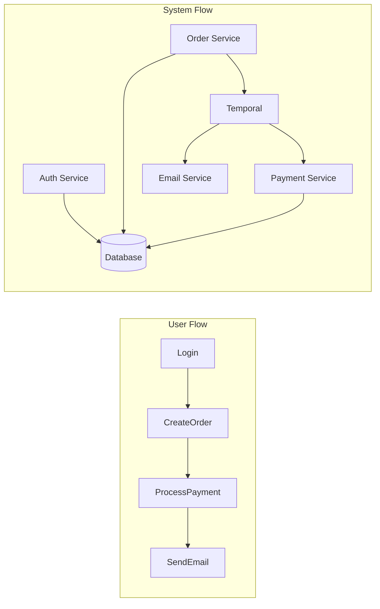
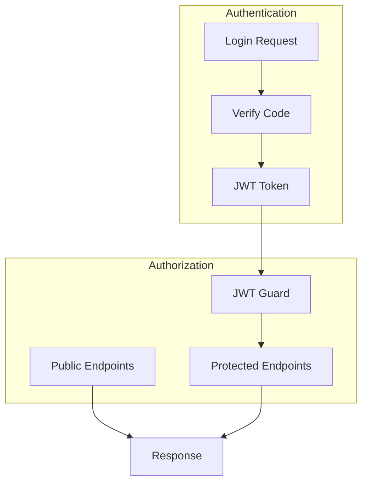
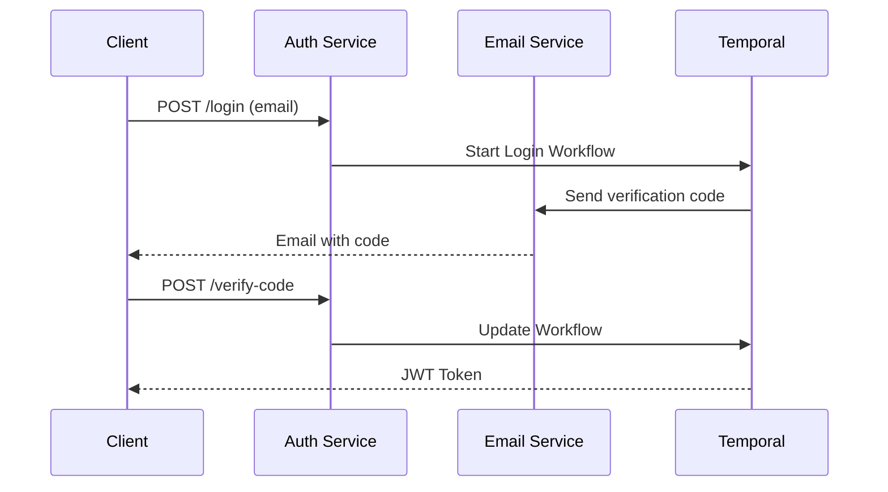
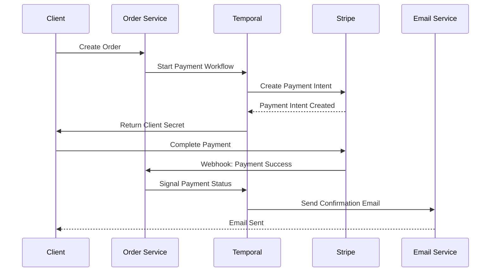

# Temporal Concepts and ProjectX Implementation

## Section 1: Introduction to Temporal (Slides 1-5)

### Slide 1: What is Temporal?
- A microservices orchestration platform
- Handles distributed system complexity
- Ensures reliable execution of business logic

### Slide 2: Key Temporal Concepts
- Workflows
- Activities
- Signals
- Queries
- State Management

### Slide 3: Why Temporal?
- Durability
- Reliability
- Scalability
- Visibility

### Slide 4: When to Use Temporal?
- Long-running processes
- Distributed transactions
- State-dependent workflows
- Complex orchestration

### Slide 5: Temporal vs Traditional Architecture
- Traditional: Complex error handling, state management
- Temporal: Built-in reliability, state persistence

## Section 2: ProjectX Architecture (Slides 6-10)

### Slide 6: High-Level Architecture


### Slide 7: Service Architecture
- Auth Service (8081)
- Order Service (8082)
- Product Service (8083)
- Shared Libraries

### Slide 8: Event Flow


### Slide 9: Security Architecture


### Slide 10: Technology Stack
- Frontend: React, React Query
- Backend: NestJS, TypeScript
- Database: PostgreSQL
- Workflow: Temporal
- APIs: Stripe, SendGrid

## Section 3: Login Workflow Deep Dive (Slides 11-20)

### Slide 11: Login Workflow Overview
- Email-based authentication
- Code verification
- Session management

### Slide 12: Login Workflow State
```typescript
interface LoginWorkflowState {
  codeStatus: LoginWorkflowCodeStatus;
  status: LoginWorkflowStatus;
  code?: string;
  user?: UserDto;
}
```

### Slide 13: Login Activities
```typescript
class ActivitiesService {
  async sendLoginEmail(email: string) {
    const code = generateRandomSixDigitNumber();
    await this.emailService.sendLoginEmail(
      { token: code, userName: email },
      email
    );
    return await hashValue(code);
  }

  async verifyLoginCode(email: string, code: number, hashedCode: string) {
    const isValid = await compareValue(code.toString(), hashedCode);
    return isValid ? await this.userService.getOrCreate(email) : undefined;
  }
}
```

### Slide 14: Login Workflow Implementation
```typescript
export async function loginUserWorkflow(data: LoginWorkflowData): Promise<void> {
  const state: LoginWorkflowState = {
    codeStatus: LoginWorkflowCodeStatus.PENDING,
    status: LoginWorkflowStatus.PENDING,
  };
  
  // Attach queries and updates
  setHandler(getLoginStateQuery, () => state);
  setHandler(verifyLoginCodeUpdate, async (code) => {
    const user = await verifyLoginCode(data.email, code, state.code);
    if (user) state.user = user;
    return { user };
  });
}
```

### Slide 15: Login Flow Sequence


### Slide 16: Error Handling
- Retry policies
- Timeout management
- Non-retryable errors

### Slide 17: Activity Configuration
```typescript
const { sendLoginEmail } = proxyActivities<ActivitiesService>({
  startToCloseTimeout: '5 seconds',
  retry: {
    initialInterval: '2s',
    maximumInterval: '10s',
    maximumAttempts: 10,
    backoffCoefficient: 1.5,
  },
});
```

### Slide 18: State Management
- Workflow queries
- State updates
- Signal handling

### Slide 19: Security Considerations
- Code hashing
- JWT implementation
- Rate limiting

### Slide 20: Testing Strategies
- Unit testing activities
- Workflow testing
- Integration testing

## Section 4: Payment Processing (Slides 21-30)

### Slide 21: Payment Workflow Overview
- Order creation
- Payment processing
- Status management

### Slide 22: Order Workflow State
```typescript
enum OrderStatus {
  Pending = 'Pending',
  Confirmed = 'Confirmed',
  Shipped = 'Shipped',
  Delivered = 'Delivered',
  Cancelled = 'Cancelled',
  Failed = 'Failed',
}
```

### Slide 23: Payment Flow


### Slide 24: Order Workflow Implementation
```typescript
export async function createOrder(
  data: OrderWorkflowData,
  state = initialState
): Promise<void> {
  state.referenceId = data.order.referenceId;
  
  // Start payment processing
  if (state.status === OrderStatus.Pending) {
    const processPaymentWorkflow = await startChild(processPayment, {
      args: [data],
      workflowId: getWorkflowIdByPaymentOrder(state.referenceId),
    });
    const result = await processPaymentWorkflow.result();
    state.status = result.status === OrderProcessPaymentStatus.SUCCESS
      ? OrderStatus.Confirmed
      : OrderStatus.Failed;
  }
}
```

### Slide 25: Payment Processing Workflow
```typescript
export async function processPayment(
  data: OrderWorkflowData
): Promise<OrderProcessPaymentState> {
  const state: OrderProcessPaymentState = {
    status: OrderProcessPaymentStatus.PENDING,
  };

  setHandler(paymentWebHookEventSignal, async (event: PaymentWebhookEvent) => {
    if (confirmedWebhookEvents.includes(event.type)) {
      state.status = OrderProcessPaymentStatus.SUCCESS;
    }
  });

  await condition(
    () => finalPaymentStatuses.includes(state.status),
    PROCESS_PAYMENT_TIMEOUT
  );

  return state;
}
```

### Slide 26: Webhook Integration
- Event types
- Status mapping
- Error handling

### Slide 27: Child Workflows
- Parent-child relationship
- Communication
- Error propagation

### Slide 28: Compensation Handling
- Payment cancellation
- Refund processing
- State rollback

### Slide 29: Monitoring and Observability
- Workflow tracking
- Payment status
- Error reporting

### Slide 30: Best Practices
- Idempotency
- Timeout configuration
- Error handling

## Section 5: Advanced Concepts (Slides 31-35)

### Slide 31: Workflow Patterns
- Saga pattern
- Event sourcing
- CQRS

### Slide 32: Scalability
- Horizontal scaling
- Load balancing
- Resource management

### Slide 33: High Availability
- Failover handling
- Data replication
- System redundancy

### Slide 34: Performance Optimization
- Caching strategies
- Query optimization
- Activity batching

### Slide 35: Security Best Practices
- Authentication
- Authorization
- Data encryption

## Section 6: Development and Operations (Slides 36-40)

### Slide 36: Development Environment
- Local setup
- Docker configuration
- Development tools

### Slide 37: Testing Strategy
- Unit testing
- Integration testing
- End-to-end testing

### Slide 38: Deployment
- CI/CD pipeline
- Environment configuration
- Monitoring setup

### Slide 39: Troubleshooting
- Common issues
- Debugging tools
- Support resources

### Slide 40: Future Enhancements
- Planned features
- Scalability improvements
- Integration possibilities